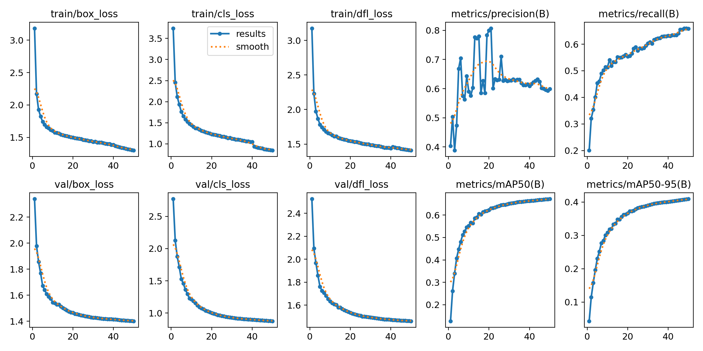
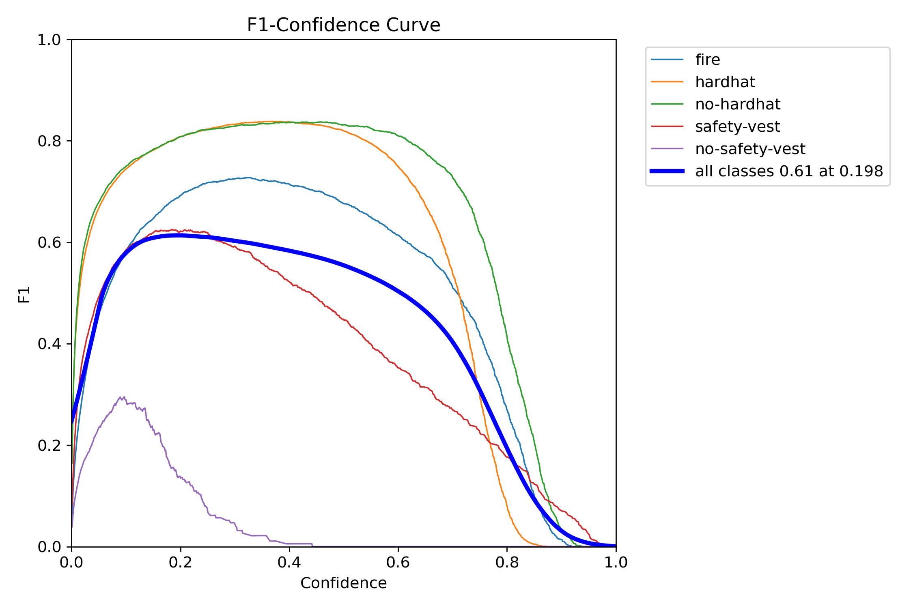
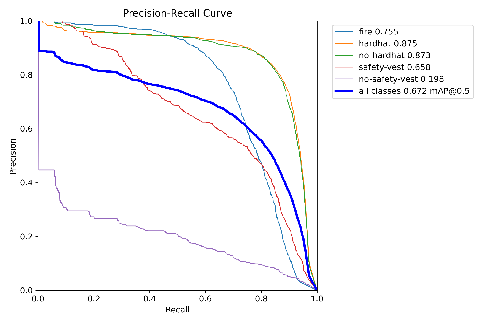
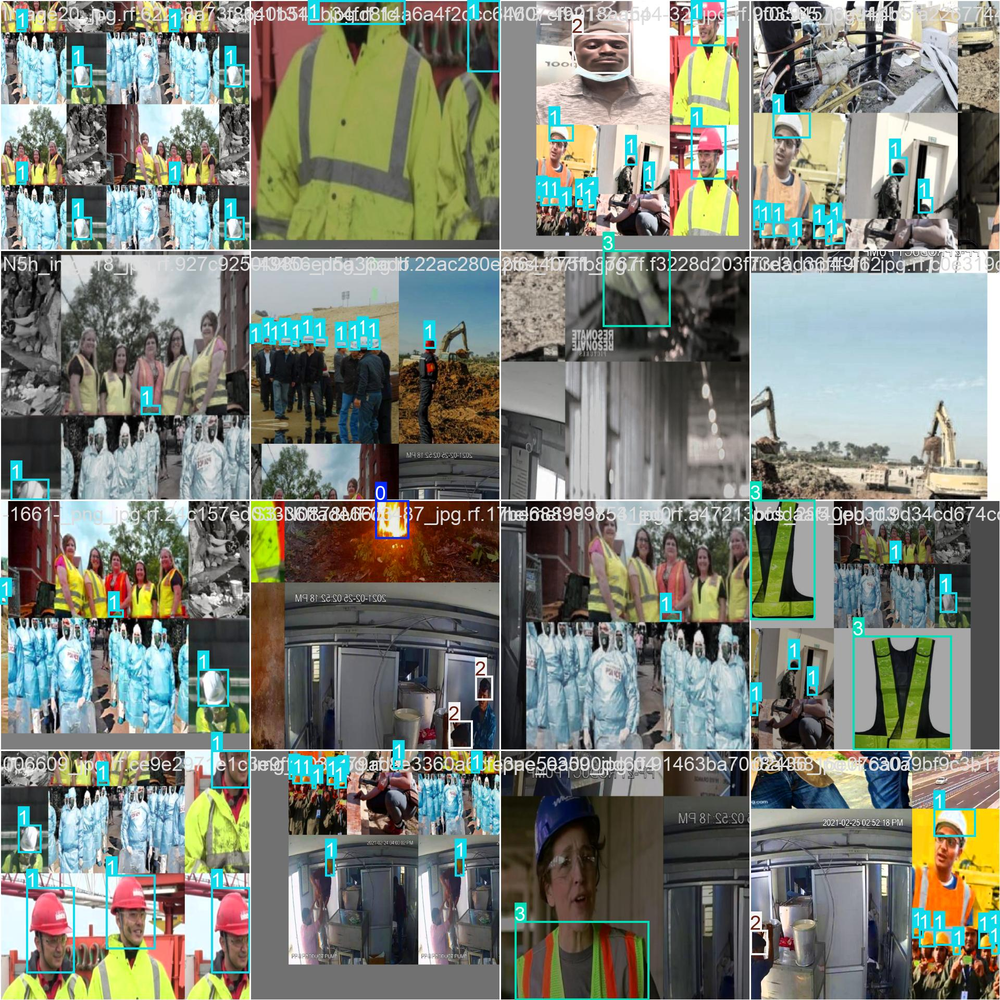
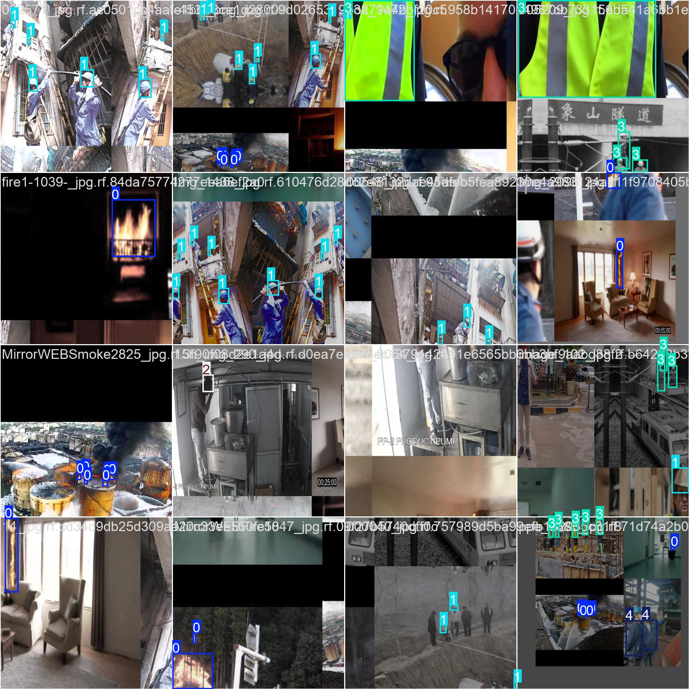
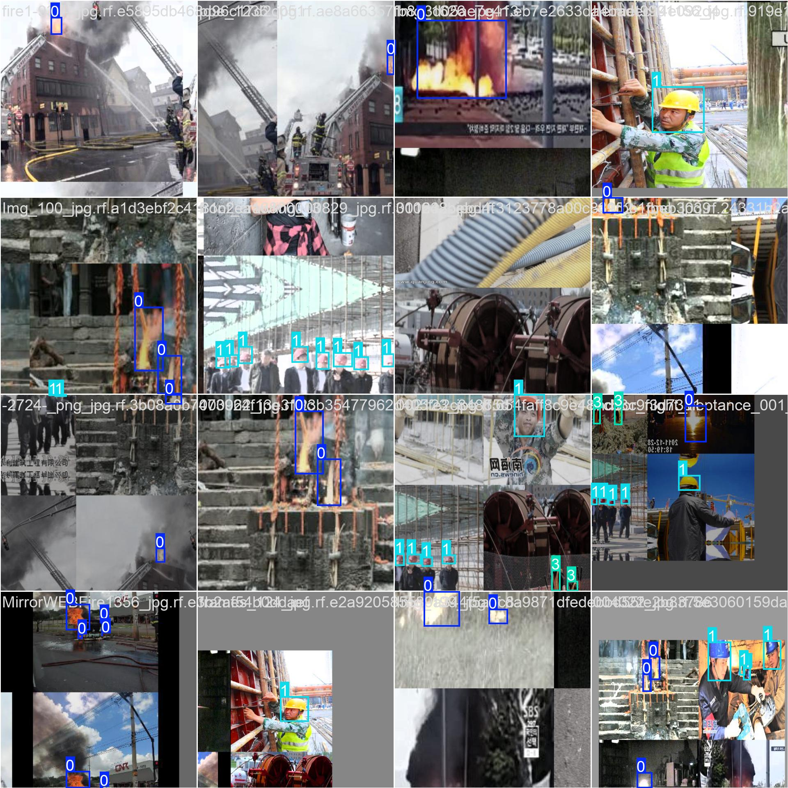
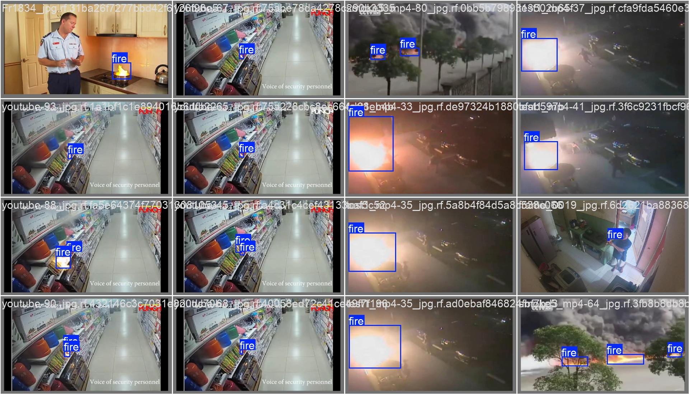
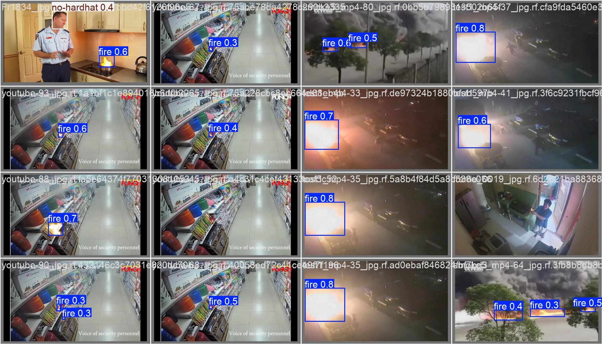
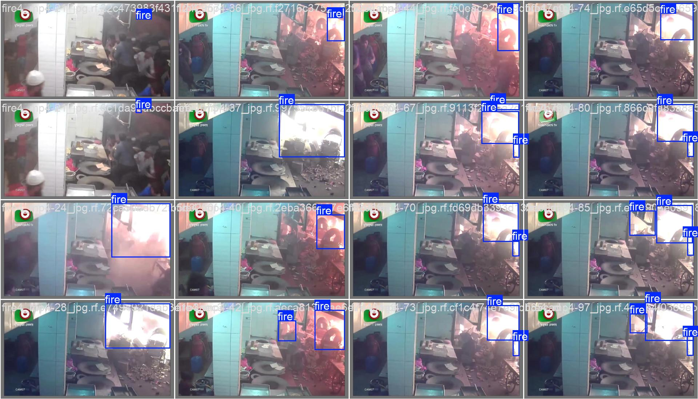
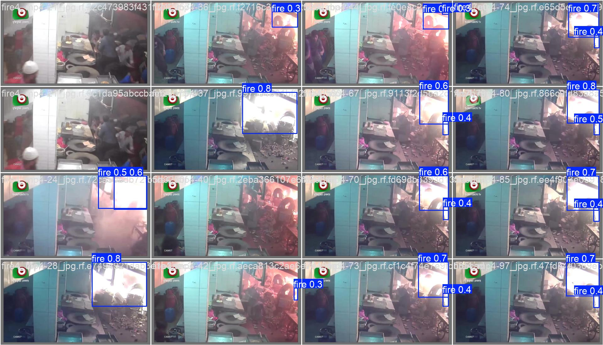

# 电力设施安全检测模型训练与可视化监控系统

基于YOLOv8算法实现的电力设施安全检测系统，能够检测明火、安全帽佩戴情况和工作服合规性。系统包含完整的训练流程和可视化监控界面。

## 项目概述

本项目旨在构建一个能够在电力设施环境中进行安全检测的AI模型及配套可视化监控系统，包括以下功能：

1. 明火检测（Fire Detection）
2. 安全帽佩戴检测（Hardhat Detection）
3. 工作服合规性检测（Safety Vest Detection）

系统采用模块化设计，分为模型训练部分和可视化监控界面两大部分。

## 目录结构

```
.
├── dataset/                    # 数据集目录
│   ├── Personal_Protective/   # 个人防护装备数据集
│   ├── fire/                  # 火焰烟雾数据集
│   └── powerplant_safety/     # 合并后的数据集（由脚本生成）
├── exported_models/           # 导出的模型文件
├── predictions/               # 预测结果示例
├── powerplant_safety_detection/ # 模型训练输出目录
├── src/                       # 可视化界面源代码
│   └── monitor/               # 监控系统代码
│       ├── ui/                # 界面文件
│       ├── core/              # 核心模块
├── yolov8n_powerplant.yaml    # 模型配置文件
├── train_config.yaml          # 训练配置文件
├── config.yaml                # 界面配置文件
├── data_preprocess.py         # 数据预处理脚本
├── train.py                   # 模型训练脚本
├── evaluate.py                # 模型评估脚本
├── export_model.py            # 模型导出脚本
├── main.py                    # 训练主程序入口
├── src/monitor/main_ui.py     # 可视化界面主程序
├── requirements.txt           # 项目依赖
└── README.md                 # 项目说明文档
```

## 环境要求

- Python 3.8+
- CUDA 11.0+ (可选，用于GPU加速)
- Windows 10/11 或 Linux

## 安装步骤

1. 克隆或下载项目代码

2. 创建虚拟环境（推荐）：
   ```bash
   python -m venv venv
   source venv/bin/activate  # Linux/Mac
   venv\Scripts\activate     # Windows
   ```

3. 安装依赖：
   ```bash
   pip install -r requirements.txt
   ```

## 使用方法

### 1. 数据预处理
```bash
python data_preprocess.py
```

该脚本会合并两个数据集并生成适合训练的格式。

### 2. 模型训练
```bash
python train.py
```

或者使用主程序：
```bash
python main.py --mode train
```

### 3. 模型评估
```bash
python evaluate.py
```

或者使用主程序：
```bash
python main.py --mode eval
```

### 4. 模型导出
```bash
python export_model.py
```

或者使用主程序：
```bash
python main.py --mode export
```

### 5. 全流程执行
```bash
python main.py --mode all
```

或者交互式运行：
```bash
python main.py
```

### 6. 运行可视化监控界面
```bash
python src/monitor/main_ui.py
```

## 配置文件说明

### 模型配置文件 (yolov8n_powerplant.yaml)
定义了模型的网络结构和参数。

### 训练配置文件 (train_config.yaml)
包含了训练过程的各项超参数：
- epochs: 训练轮次
- batch: 批次大小
- imgsz: 图像尺寸
- optimizer: 优化器类型
- learning rate: 学习率等

### 界面配置文件 (config.yaml)
包含了可视化界面的配置参数：
- 模型路径
- 置信度阈值
- 类别映射
- 数据库配置

## 输出结果

训练完成后，会在以下目录生成结果：

- `powerplant_safety_detection/`: 训练过程和结果
- `exported_models/`: 导出的不同格式模型文件
- `predictions/`: 评估时生成的预测结果示例
- `safety_monitor.db`: 安全监控数据库

## 训练结果详情

### 模型性能指标

经过50个epoch的训练，模型在验证集上达到了以下性能指标：

| 指标 | 最终值 | 最佳值 |
|------|--------|--------|
| Precision | 0.599 | 0.807 |
| Recall | 0.658 | 0.655 |
| mAP@0.5 | 0.672 | 0.672 |
| mAP@0.5:0.95 | 0.409 | 0.409 |

注：以上数值来自训练日志，最终模型在第50个epoch达到最佳性能。

### 训练损失曲线

训练过程中各项损失的变化趋势如下：

1. 训练损失 (Train Loss)
   - Box Loss: 从3.18降至1.30
   - Class Loss: 从3.74降至0.846
   - DFL Loss: 从3.18降至1.41

2. 验证损失 (Validation Loss)
   - Box Loss: 从2.34降至1.40
   - Class Loss: 从2.77降至0.876
   - DFL Loss: 从2.52降至1.46

### 训练可视化结果

训练过程中生成的重要可视化文件包括：

- `results.png`: 包含所有指标变化曲线的综合图
- `BoxF1_curve.png`: F1分数变化曲线
- `BoxPR_curve.png`: PR曲线
- `confusion_matrix.png`: 混淆矩阵
- `train_batch*.jpg`: 训练批次样本
- `val_batch*_pred.jpg`: 验证集预测结果

#### 训练过程指标图








#### 训练批次样本







#### 验证集结果







### 最佳模型权重

训练产生的最佳模型权重文件位于：
`powerplant_safety_detection/yolov8n_experiment/weights/best.pt` (约6.1MB)

## 系统优化与修复

### 中文标签显示问题修复

在早期版本中，检测结果的中文标签可能会显示为问号。现已通过以下方式修复：

1. 使用Pillow库进行中文字符渲染
2. 将PIL图像转换回OpenCV格式
3. 添加字体加载失败的回退机制

现在系统可以正确显示中文标签，如"明火 0.69"。

### 性能优化

1. 摄像头输入优化：
   - 减少缓冲区大小以降低延迟
   - 设置固定帧率以提高稳定性
   - 添加暂停时的休眠机制以减少CPU使用

2. 模型推理优化：
   - 添加推理结果缓存机制，避免重复帧的重复计算
   - 增加推理超时检测和处理
   - 优化边界框和标签绘制逻辑

3. 界面响应优化：
   - 改进多线程处理避免界面卡顿
   - 限制风险列表项数量防止内存泄漏
   - 添加性能监控显示(FPS和推理时间)

### 数据库功能完善

1. 自动创建数据库表：
   - 识别记录表(recognition_records)
   - 告警日志表(alarm_logs)

2. 数据管理优化：
   - 添加数据插入前的表存在性检查
   - 实现过期记录自动清理功能
   - 增强错误处理和日志记录

## 性能指标

期望达到的性能指标：

| 目标类型 | 精确率≥ | 召回率≥ | mAP@0.5≥ | 单帧推理时间(CPU)≤ |
|---------|--------|--------|----------|-------------------|
| 明火 | 95% | 98% | 96% | 200ms |
| 安全帽(戴/未戴) | 92% | 90% | 91% | 200ms |
| 工作服(合规/不合规) | 88% | 85% | 86% | 200ms |

## 可视化界面功能

### 界面架构
采用五层解耦架构：
1. 界面交互层 - 用户操作入口
2. 数据输入层 - 支持图片、摄像头、视频三种输入源
3. 模型推理层 - 对接训练好的YOLO模型
4. 结果展示层 - 实时显示检测结果和风险告警
5. 数据存储层 - 历史记录存储与查询

### 主要特性
- 多输入源支持：本地图片、摄像头、本地视频
- 实时检测与标注显示
- 风险分级告警（视觉+听觉）
- 置信度阈值可调
- 历史记录存储与查询
- 多线程处理避免界面卡顿

### 界面操作指南

1. **选择输入源**：
   - 点击"本地图片"按钮选择一张图片进行检测
   - 点击"摄像头"按钮使用电脑摄像头进行实时检测
   - 点击"本地视频"按钮选择一段视频进行检测

2. **控制操作**：
   - 点击"开始识别"按钮开始检测
   - 点击"暂停识别"按钮暂停检测
   - 点击"停止识别"按钮停止检测并返回初始状态

3. **参数调节**：
   - 拖动置信度滑块调整检测灵敏度（0.4-0.9）
   - 勾选或取消勾选"启用声音告警"控制声音提醒

4. **查看结果**：
   - 左侧上方显示原始图像/视频
   - 左侧下方显示标注后的检测结果
   - 右侧上方显示检测到的风险列表
   - 底部显示当前状态和紧急告警信息

### 风险等级分类

系统根据检测到的目标类型划分风险等级：

- **紧急风险**：检测到明火（红色标识）
- **高风险**：检测到未佩戴安全帽（黄色标识）
- **中风险**：检测到不合规工作服（橙色标识）
- **安全**：检测到佩戴安全帽或合规工作服（绿色标识）

## 支持的导出格式

1. **ONNX**: 跨平台部署
2. **TensorRT**: GPU部署优化
3. **TorchScript**: PyTorch生态部署
4. **OpenVINO**: Intel硬件优化部署

## 注意事项

1. 首次运行时会自动下载YOLOv8预训练权重
2. 训练过程中的检查点会自动保存
3. 可以随时中断训练，下次运行时可选择恢复训练
4. 根据硬件配置适当调整batch size和image size
5. 确保配置文件中的模型路径正确指向训练好的模型文件
6. 可视化界面运行时需要保证模型文件路径正确
7. 系统会自动清理30天以前的历史记录以节省存储空间

## 故障排除

常见问题及解决方案：

1. **模型加载失败**：
   - 检查[config.yaml](file:///d:/TN/1/config.yaml)中模型路径是否正确
   - 确认模型文件是否存在

2. **摄像头无法打开**：
   - 检查摄像头是否被其他程序占用
   - 确认摄像头驱动是否正常

3. **中文标签显示为问号**：
   - 系统已通过Pillow库优化字体显示
   - 如仍有问题可尝试安装系统中文字体

4. **推理速度慢**：
   - 确保使用GPU进行推理（如果有）
   - 关闭其他占用大量资源的程序
   - 降低输入视频的分辨率

## 联系方式

如有问题或建议，请联系：2715209705@qq.com